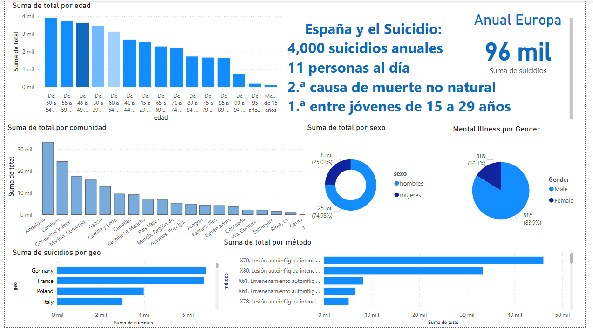

# Trigger Key Words: Suicide Prevention through Text Analysis

## Project Description
Suicide is one of the leading causes of mortality worldwide and an urgent public health issue. Many individuals at risk express warning signs through their words, whether in conversations, social media, or writings. However, these messages often go unnoticed, leaving those in need without the necessary intervention.

This project leverages **Natural Language Processing (NLP)** algorithms to identify key words associated with suicide risk in texts. The main objective is to contribute to **suicide prevention** by enabling early detection of these signals, facilitating a faster and more effective response. By combining data analysis, predictive modeling, and an interactive application, this project aims to generate value in academic research and potential practical applications.

---
## 🗂️ **Project Structure**
The project is organized modularly to ensure clarity and efficient management. Here's the main structure:

### 📂 `app/`
🚀 **Where the magic happens**  
- Contains the main `app.py` file, which implements the interactive application using **Streamlit**.  
- Enables intuitive exploration of data analysis results and model predictions.  

---

### 📂 `data/`
📊 **Original datasets**  
- Stores the raw data used in the project:
  - `Clasificacion_textos_suicido.csv`: Categorized messages related to suicide risk.  
  - `Clasificacion_tweers_suicidio.csv`: Processed tweets related to the topic.  
  - `Demografía_Residencia_Suicidio.csv`: Demographic and residence information.  
  - `Salud_Mental_Entorno_Laboral.csv`: Data on mental health in the workplace.  
  - Other complementary files for analysis.

---

### 📂 `data_limpio/`
🧽 **Cleaned and processed data**  
- Contains datasets prepared for analysis and predictive modeling:  
  - Example: `Clasificacion_textos_suicido_Limpio.csv`.  
  - Tokenized versions and other formats representing various stages of data processing.  
- Lightweight, uncompressed files for quick access.  

---

### 📂 `notebooks/`
📖 **Organized Jupyter Notebooks**  
- **Data Analysis**:  
  - `1_Visualización_data.ipynb`, `2_Limpieza.ipynb`.  
- **Machine Learning**:  
  - `1_Preparación y Exploración de Datos.ipynb`, `5_Entrenamiento del Modelo.ipynb`, and more.   

---

### 📂 `scripts/`
🔧 **Reusable tools**  
- Scripts for common tasks, such as:  
  - Data preprocessing.  
  - Model training.  
  - Visualization tools.  

---

### Access Files
All the files mentioned are compressed and accessible via [this Drive link](https://drive.google.com/file/d/1i9iC9IdpwTLvW-D9R_jNnlaBFHshC3_I/view?usp=drive_link).

---
## Data Analysis: Interactive Exploration of Suicide Data

Welcome to the **Data Analysis** section. Here, you can explore interactive charts and insights derived from the analysis.

### 📈 Available Analyses
Select the analysis you wish to explore:
- **Distribution in Spain**
- **Distribution by Age and Gender**
- **Suicide Methods**
- **European Trends**
- **Suicide Distribution in Spain by Autonomous Community**

---

### 🌟 Key Indicators (KPIs)

| **Indicator**                                  | **Value**                                      |
|-----------------------------------------------|-----------------------------------------------|
| **Suicide Rate in Men**                        | 77.6%                                         |
| **Suicide Rate in Women**                      | 22.4%                                         |
| **Highest Annual Rate (Lithuania)**            | 31.84%                                       |
| **Lowest Annual Rate (Cyprus)**                | 2.95%                                        |
| **Most Affected Autonomous Communities (Spain)** | Andalucía, Cataluña, Comunitat Valenciana     |
| **Most Frequent Methods**                     | Hanging, Poisoning, Jumping from high places  |
| **Most Affected Age Groups**                  | 50-54 years and 75-79 years                  |

---

### 📊 Analysis Summary
The analysis of suicide data in **Spain and Europe** has allowed us to identify key trends:

- **Gender**: The proportion of suicides is significantly higher in men (77.6%) than in women (22.4%).
- **Age**: The most affected age ranges are 50-54 years and 75-79 years.
- **Region**: **Andalucía**, **Cataluña**, and **Comunitat Valenciana** are the autonomous communities with the highest number of suicides in Spain.
- **Methods**: Hanging is the most used method, followed by poisoning and jumping from high places.
- **Europe**: Lithuania has the highest average suicide rate in Europe (31.84%), while Cyprus has the lowest (2.95%).

These findings are essential for understanding the factors contributing to suicide and guiding tailored prevention strategies.

---

### 📊 Dashboard Power BI
The image below is a screenshot of the dashboard developed in **Power BI**, showcasing key visualizations for data analysis.

You can access the file in **Power BI** from my [Github Repository](#).

---

### 🌐 Final Reflection and Next Steps

#### A Global Issue: Suicide Prevention
Suicide is a **multifactorial global issue** that affects millions of people each year. The analyzed data has revealed critical patterns, allowing us to better understand its causes and characteristics. However, suicide prevention requires **coordinated efforts** by public and private entities, combining educational, social, and technological approaches.

#### Key Development: A Machine Learning Model
One groundbreaking tool we have developed is a **Machine Learning model** designed to analyze text for warning signs. This model could become a valuable resource for identifying high-risk cases and enabling early intervention.

---
## Machine Learning Process: Model Preparation, Training, and Comparison

### 🧠 Text Classification Model
This section outlines the **Machine Learning process** for classifying texts as **suicidal** or **non-suicidal**. It involves three major steps:

- **Data Preparation**: Organizing and preprocessing text data for analysis.
- **Model Training**: Using algorithms to create predictive models.
- **Benchmark Evaluation**: Comparing model performance and selecting the final model.

These steps ensure a **robust and accurate classification process**, culminating in a model ready for deployment through the **Streamlit application**.

---

### ⚙️ 1. Data Preparation

- **Data Loading**:
  - Datasets of classified notes and tweets were combined into the categories `suicide` and `non-suicide`.
- **Text Cleaning**:
  - Removal of special characters and null values.
  - Conversion to lowercase and elimination of textual noise.
- **Numerical Representation**:
  - Transformation of textual data using techniques like **TF-IDF** (Term Frequency-Inverse Document Frequency).

---

### 🧪 2. Evaluated Models

A variety of Machine Learning models were evaluated:

| **Model**                | **Performance Notes**                                                     |
|--------------------------|---------------------------------------------------------------------------|
| **K-Nearest Neighbors (KNN)** | Low performance due to class imbalance and high dimensionality.          |
| **Random Forest**         | Excellent balance between precision and recall.                           |
| **Naive Bayes**           | Reasonable performance, but inferior to Random Forest and other advanced models. |
| **XGBoost**               | Very good performance, with high accuracy and generalization.             |
| **LightGBM**              | Selected as the **final model** for its superior overall performance in terms of precision, recall, and efficiency. |

---

### 📊 3. Model Metrics Comparison

A performance table summarizing key metrics across models:

| **Model**        | **Accuracy (%)** | **Macro F1-Score (%)** | **Weighted Avg (%)** |
|------------------|------------------|------------------------|-----------------------|
| **KNN**          | 44.00           | 31.00                 | 28.00                |
| **Random Forest** | 89.04           | 89.00                 | 88.00                |
| **Naive Bayes**   | 86.43           | 84.50                 | 85.00                |
| **XGBoost**       | 89.57           | 89.50                 | 89.00                |
| **LightGBM**      | **90.17**       | **90.00**             | **90.00**            |

---

### 🛠️ 4. Predictions and Class Proportions

#### **Prediction Distribution for LightGBM Model**
This model predicts texts as either **suicidal** or **non-suicidal** with high accuracy.

#### **Proportions by Class**
Visualizations include pie charts that showcase the percentage breakdown of predicted classes for insights into data patterns. 

---

### 🔍 5. Process Conclusions

- **Selected Model**: **LightGBM**, chosen for its superior performance:
  - **Accuracy**: **90.17%**
  - **Balanced Precision and Recall**
- Robust data preparation steps ensured effective handling of complex data.
- This model is ready for **deployment** through the **Streamlit application**, making it a valuable resource for suicide prevention systems.

---

## 📜 Conclusions and Reflections

### 🌟 Reflections and Future Improvements
This project represents a significant step in leveraging technology for suicide prevention, yet there are areas for improvement:

- **Dataset Expansion**: Incorporate global data and multilingual texts to improve representativeness.
- **Model Optimization**: Experiment with new deep learning algorithms to capture more complex patterns.
- **Real-Time Implementation**: Develop a practical application to analyze social media posts and texts to alert possible risks.
- **Interdisciplinary Collaboration**: Partner with mental health and ethics professionals to ensure the appropriate use of technology.

---

### 📚 Academic Disclaimer
This project was developed as part of an **academic endeavor** and does not have medical backing. 
The data and conclusions should not be considered an official diagnosis or treatment. 
Its purpose is to contribute to **research** and **learning** in the field of data analysis and Machine Learning.

---

### 🙏 Acknowledgments
This project is my **final project at Ironhack**, the result of months of learning and dedication.  
I want to express my gratitude to my instructors, colleagues, and the Ironhack team for all the support and shared knowledge.  
This achievement is also thanks to the collaborative and enriching environment of the program.

---

### Connect with Me:
**Cristina Puertas Camarero**  
📧 **cris.puertascamarero@gmail.com**  
- **GitHub**: [Cristina-Puertas-Camarero](https://github.com/Cristina-Puertas-Camarero)  
- **LinkedIn**: [Cristina Puertas Camarero](https://www.linkedin.com/in/cristina-puertas-camarero-8955a6349/)  

